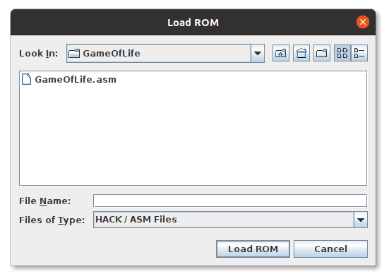

# game-of-life-hack-asm
Coway's Game of Life implementation on Hack computer's assembly language (specifications in nand2tetris course)

# Running the Game of Life
## Dependencies
* Java
* CPU Emulator (located in tools folder)

## Running Simulation
You may need to add executable permission to `CPUEmulator.sh`
```bash
chmod +x ./tools/CPUEmulator.sh
```

Run CPU Emulator (from tools folder)
```bash
./tools/CPUEmulator.sh
```


File -> Load Program -> select GameOfLife.asm (from Game Of Life folder)


File -> Load Script -> select .tst files (from Game Of Life folder)


From Animate dropdown select `No Animation`

Click run to see simulation (may be slow due to emulation process)